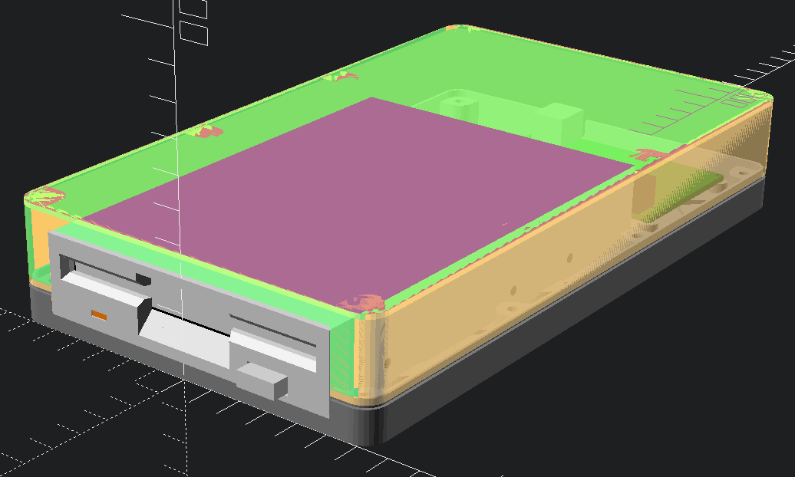
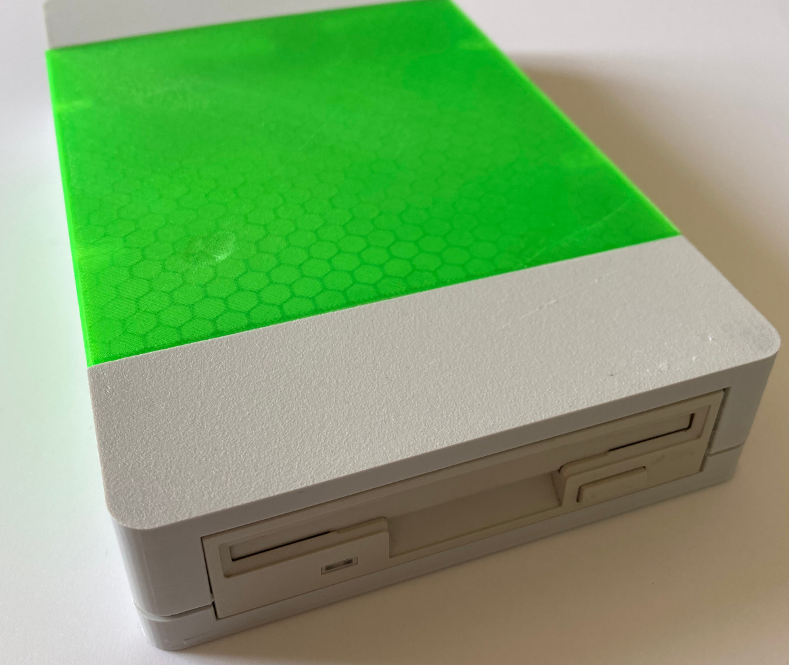

# Greaseweazle v4 case

Case for Greaseweazle v4 and 3.5" floppy drive by hadessuk.

### Parts

Knurled brass threaded inserts:

- 8 x M3x5 (for the case)
- 4 x M2x5 (for the Greaseweazle)

Bolts:

- 8 x M3x10 hex (for the case)
- 4 x M2x4 hex (for the Greaseweazle)
- 4 x M3x5 Phillips (to mount drive)

To complete the device, you will also need a working 3.5" drive, a floppy drive
ribbon cable, and either jumper cables or a cable with a Berg connector, and
a [Greaseweazle v4](https://www.sordan.ie/product/1003/greaseweazle-v4-usb-floppy-adapter-flux-reader-writer/).

This case requires the drive to be powered by the Greaseweazle, and makes no
accommodation for drives that require too much power or 12V.

### STL files

STL files are [available on Printables.com](https://www.printables.com/model/219991-case-for-greaseweazle-v4-and-35-floppy-drive).

You can also generate them on Unix systems if `openscad` is in your `PATH` by running `make`.

### Model variants

2 different set of models exist.

- the simplest are the `big-*` files. One model for the top and one model for
the bottom of the drive case. This requires a printer that can print at least 22cm x 14cm.
- the more complicated `small-*` models use 2 parts for the bottom case, and 3
parts for the top case. The top case is split in 3 and can be printed in different
materials to give it that striped look. This requires a 15cm x 15cm printer.

If your printer is big enough, you can of course use the single bottom plate with
the "small" top case models. The back and front of the small variant of the top case can usually be
printed, sequentially, in one sitting, even on a small printer.

### Known problems

- The "small" top case flexes a bit too much and could do with having a lip that prevents this.
- The holes for mounting the Greaseweazle are a bit too unforgiving when brass inserts are mounted.
- The USB port hole could be moved left to accommodate shorter ribbon cables.
- The holes in the bottom case are ever so slightly too tight for common hex head screws.

### License

Based on [Greaseweazle F7 Lightning Plus case](https://www.thingiverse.com/thing:4920473)
by [n13ldo](https://www.thingiverse.com/n13ldo), itself based on
[Case for Greaseweazle F7 and 3.5" floppy drive](https://www.thingiverse.com/thing:4423258/)
by [ali1234](https://www.thingiverse.com/ali1234).

Licensed under [CC BY 4.0](https://creativecommons.org/licenses/by/4.0/).
